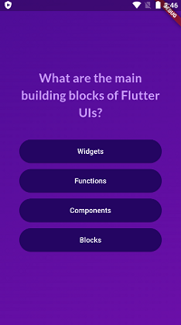
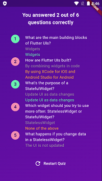

# Flutter Quiz App

A minimalistic quiz app developed in Flutter without using any state management. The app presents a series of questions to the user, allowing them to select answers. Upon answering, the app proceeds to the next question. After completing the quiz, a results page is displayed, showcasing the number of correct answers.

## Features:

- **Simplicity**: Built using raw Flutter code, keeping it lightweight and easy to understand.
- **Question Flow**: Users can seamlessly navigate through questions and select answers.
- **Results Page**: A dedicated page to display the total number of correct answers.
- **Restart Quiz**: Includes a "Restart Quiz" button on the results page for users to start the quiz again.

## Screenshots:

## Video Demo:

Check out the app  [video](https://drive.google.com/file/d/1XlJ7-hgAukxquSH2j-ML51OQvHNrezw1/view?usp=sharing).

## Download APK:

Download the APK file [here](https://drive.google.com/file/d/1RMJLMGWSBLXtgLlPDf2_rLwADfC5DfLv/view?usp=sharing).

## Usage:
Answer the questions by selecting the appropriate options.
Navigate through the quiz until all questions are answered.
View the results page to see the number of correct answers.
Use the "Restart Quiz" button to start the quiz again.
